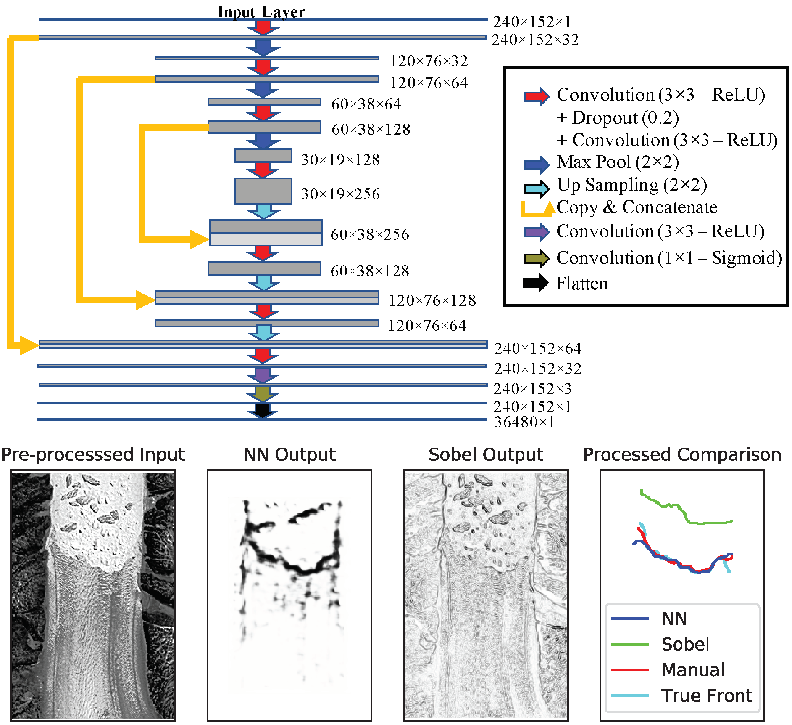

Detection of Glacier Calving Margins with Convolutional Neural Networks: A Case Study
====================

[](https://github.com/yaramohajerani/FrontLearning/blob/master/LICENSE)
[](https://zenodo.org/badge/latestdoi/128992682)

This repository includes the scripts, training data, and trained networks presented in [Mohajerani et al. (2019)](https://doi.org/10.3390/rs11010074). 


Overview of the neural network and sample results comparing the neural network, manual, and analytical (Sobel) filter performances, from [Mohajerani et al. (2019)](https://doi.org/10.3390/rs11010074).


## Citation
Please cite:
```
Mohajerani, Y.; Wood, M.; Velicogna, I.; Rignot, E. Detection of Glacier Calving Margins with Convolutional Neural Networks: A Case Study. Remote Sens. 2019, 11, 74. doi:10.3390/rs11010074
```

The latest release of this repository is also deposited on Zenodo and should be cited as:
```
Yara Mohajerani. (2020, September 23). yaramohajerani/FrontLearning: Zenodo Release (Version v1.1). Zenodo. http://doi.org/10.5281/zenodo.4044770
```

## Data
Training data and the trained networks presented in the paper are available in the `data` directory.

**Note** The provided scripts assume all data is located in ```Frontlearning_data```, which should be placed in the same directory as the folder containing this repository (not *inside* the directory containing the scripts, instead the code and data directories should be in the same parent directory).

---
For a list of Python dependencies or creating a Conda environment, please refer to `requirements.txt` or `frontlearning_env.yml`.

## Pre-processing
The training data has already been rotated and pre-processed. The rotation is done by 
`createRotatedTrainingData.py`
and
`frontlearn_preprocess.py`.

The run configurations can be specified in command line. e.g.:
```
python createRotatedTrainingData.py --glaciers=Sverdrup,Jakobshavn --coasts=NW,CW --dimensions=2,3

python frontlearn_preprocess.py --glacier=greenland_training
```
Note that the rotation script assumes the raw input data is separated by coasts in the ```Regions``` directory.

The class imbalance and training time can also be improved by cropping, using a parameter file for the configuration:
```
python crop_input.py parameters_frontlearn_allData_UNET.txt
```

## Neural network
The Neural Network (NN) is in ```unet_mode.py```. This function should be imported in the train or test scripts. Note that the number of layers, channels, drop out ratio, input image size, etc. can be specified as function arguments. Also 4 overarching architectures exist as distinct functions to choose from (with and without batch normalization and the expansion rate of the number of channels from one layer to the next.)

## Training
A trained NN can be created by using `unet_train.py`. The configurations are must be specified in a parameter file. e.g.:
```
python unet_train.py parameters_frontlearn_allData_UNET.txt
``` 
The script also outputs the training history for training and validation sets.

## Running Pre-trained Network 
Test output is also created by the script. However, if one wishes to produce predictions from a NN without training it (using an exisiting trained NN), the test script can be used:
```
python unet_test.py parameters_frontlearn_allData_UNET.txt
``` 
If using cropped data, the output can be restored back to the original dimensions using `crop_output.py` with a parameter file
```
python crop_input.py parameters_frontlearn_allData_UNET.txt
```

## Post-Processing
Finally, in order to extract the calving fronts from the NN output, use the postProcessing script, ```postProcessing.py```.
Note that for Helheim (test results in the paper) we have a custom script but the input format is indentical in either case.
```
python postProcessing_helheim.py --subdir='helheim_test' --step=50 --indir=[path to NN output]
```
Note that ```indir``` specifies the full path to the directory containing the output of the NN (produced by ```crop_output.py```), while ```subdir``` specifiese the output directory name under 
```FrontLearning_data/Results```. ```step``` corresponds to the interval size along the boundaries while searching for the path of least resistance.

#### Contact
For questions, contact [ymohajer@uci.edu](mailto:ymohajer@uci.edu).

#### License
This project is under the [Creative Commons Attribution 4.0 Attribution license](https://creativecommons.org/licenses/by/4.0/). The code presented in this repository is under the [MIT license](LICENSE).
