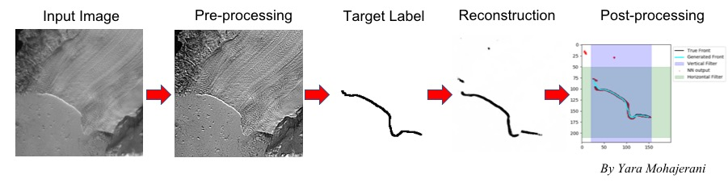

# FrontLearning
This repository contains Python scripts utilizing Keras to identify glacier calving fronts from satellite imagery. 

Scripts by Yara Mohajerani.

Training data provided by Michael Wood.

Two approaches are taken: A Convolution Neural Netowrk (CNN) with a U-Net architecture for image segmentation, and a sliding window
approach for classification of the front. The latter approach is still under development. 

## 1. Image Segmentation with U-Net

The processing is divided in 3 sections: 

1. pre-processing: `frontlearn_preprocess.py`
  * Configurations are given as commandline arguments.
  * Put data for each glacier in a different folder. Glacier name must be provided in commandline.

2. training and prediction: `unet_train_augment.py` (adds augmentation for training)
  * Uses `unet_model.py` to train a U-Net neural network whose architecture is dynamic depending on the specified parameters.
  * Run configurations should be specified in a `.txt` parameter file in command line when executing the script.
3. Post-processing - clean-up and vectorization: `unet_postprocess.py`
  * Removes any noise in the generated calving fronts and vectorizes them as Shapely LineStrings.

Old scripts during the development of this project are kept in `legacy_scripts_obsolete.dir`.

## 2. CNN Classification with Sliding Windows

Still under development.

More details will be provided as the project moves forward.

For questions contact <ymohajer@uci.edu>.
