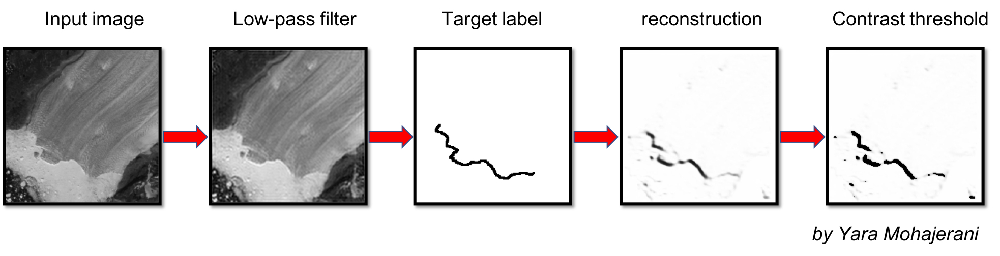

# FrontLearning

This repository contains Python scripts utilizing Keras to implement a Convolution Neural Netowrk (CNN) to identify glacier calving fronts from satellite imagery.

Scripts by Yara Mohajerani.

Training data provided by Michael Wood.

Old scripts during the development of this project are kept in `legacy_scripts_obsolete.dir`.

The processing is divided in 3 sections: 

1. pre-processing: `frontlearn_preprocess.py`
  * Configurations are given as commandline arguments.
  * Put data for each glacier in a different folder. Glacier name must be provided in commandline.

2. training and prediction: `frontlearn_train.py` or `frontlearn_train_augment` (adds augmentation for training)
  * Uses `frontlearn_unet_dynamic.py` to train a U-Net neural network whose architecture is dynamic depending on the specified parameters.
  * Run configurations should be specified in a `.txt` parameter file in command line when executing the script.
3. Post-processing - clean-up and vectorization: `frontlearn_postprocess.py`
  * Removes any noise in the generated calving fronts and vectorizes them as Shapely LineStrings.

  
More details will be provided as the project moves forward.

For questions contact <ymohajer@uci.edu>.
